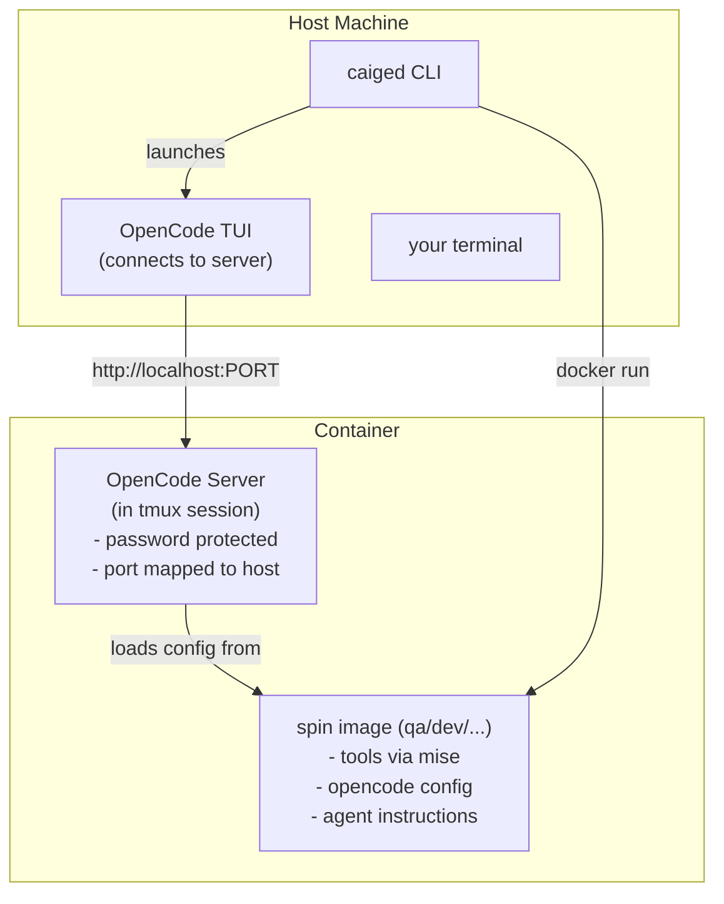

# Caiged

**Run AI coding agents in isolated, role-specific Docker environments.**

Caiged lets you launch coding agents (like OpenCode) inside Docker containers with:
- **Security-first design**: explicit bind mounts, minimal host access
- **Role-specific "spins"**: preconfigured agent personas (QA, engineer, reviewer) with tailored instructions, skills, and tools
- **OpenCode server mode**: each container runs an OpenCode server, connect from host with TUI client

```bash
caiged . --spin dev             # Smart attach/create in current directory
```

This creates (or attaches to) a container with OpenCode server running, automatically connecting you to the TUI.

---

## Why Use Caiged?

**Isolation**: Keep AI agents from accidentally accessing sensitive files or making unintended system changes.

**Consistency**: Every team member gets the same tooling (gh, git, mise, bun, opencode) with pinned versions.

**Role-specific context**: QA agents get QA skills and instructions, reviewers get review workflows—no mixing concerns.

**Simple workflow**: One command to create or attach - `caiged` just works.

---

## Quick Start

### Installation

```bash
git clone <path-to-repo> ~/.caiged
cd ~/.caiged
make install
```

This builds the CLI and copies it to `~/.local/bin/caiged`.

### Run Your First Spin

```bash
cd /path/to/your/project
caiged
```

That's it! The CLI will:
1. Create a container if none exists (or attach to existing)
2. Start the OpenCode server inside
3. Connect you to the OpenCode TUI

Inside the container:
- OpenCode server runs with password authentication
- Password is automatically generated (deterministic from container name + salt)
- OpenCode auth is reused automatically from host `~/.local/share/opencode/auth.json` when present
- If host OpenCode auth is missing, run OpenCode auth once inside the container (`/connect` in the OpenCode TUI)
- For provider or service credentials, pass explicit secret env vars with `--secret-env`

### Common Workflows

**Default - just run it:**
```bash
caiged . --spin dev   # Current directory, dev spin
```

**Explicit workdir:**
```bash
caiged /path/to/project --spin qa
```

**Connect to an existing container by project name:**
```bash
caiged connect qa-myproject
```

**List all containers with easy-to-copy commands:**
```bash
caiged session list
```

**Stop everything:**
```bash
caiged session stop-all
```

**Force rebuild with latest tools:**
```bash
OPENCODE_VERSION=latest caiged --rebuild-images
```

**Pass selected host secrets into the container:**
```bash
export JFROG_OIDC_USER=...
export JFROG_OIDC_TOKEN=...

caiged --secret-env JFROG_OIDC_USER --secret-env JFROG_OIDC_TOKEN
```

---

## How It Works



1. **CLI** (`caiged`) builds the base image + spin image (if needed)
2. **Container** starts with your project directory bind-mounted
3. **OpenCode server** runs inside container with password authentication
4. **OpenCode TUI** connects to the server via HTTP from host
5. You work with the OpenCode TUI connected to the isolated agent

**Container naming**: `caiged-<spin>-<project>`
- Default project name: last two path segments of your working directory
- Override: `--project <name>`

**Password generation**: Deterministic SHA256 hash from container name + salt
- Salt stored in `~/.config/caiged/salt` (created once)
- CLI regenerates same password for connecting to existing containers

---

## Spins

Spins live under `spins/` and define a role-specific environment:
- `AGENTS.md`: detailed agent instructions and persona
- `skills/`: domain-specific skills (test generation, security review, etc.)
- `mcp/`: MCP server configs
- `README.md`: spin-specific documentation

**Available spins:**
- `qa`: exhaustive testing, security/reliability reviews, performance analysis

**Creating new spins:**

The build process automatically handles new spins - just create a directory under `spins/<name>/` with the required files and run:

```bash
caiged build . --spin <name>
```

See [SPINS.md](SPINS.md) for detailed instructions on creating and contributing spins

---

## Configuration

### Tools and Versions

Tools are installed via `mise` with versions pinned in `config/target_mise.toml`:
- bun 1.3.9
- go 1.26.0

OpenCode is installed via `bun add -g opencode-ai` (default `OPENCODE_VERSION=latest`).

### Security Defaults

- **Network**: uses bridge networking with port mapping by default; disable with `--disable-network`
  - Bridge networking with port mapping allows secure OpenCode server access from host
  - Each container gets a unique port (starting at 4096) mapped to container port 4096
  - With `--disable-network`, container uses `--network=none` for full isolation
- **Docker socket**: mounted by default; disable with `--disable-docker-sock`
- **GitHub config**: mounted read-only from `~/.config/gh`; make read-write with `--mount-gh-rw`
- **OpenCode auth reuse**: host `~/.local/share/opencode/auth.json` is mounted read-only when available; disable with `--no-mount-opencode-auth`
- **Secret env passthrough**: only explicitly listed host env vars are passed to the container (`--secret-env NAME`, repeatable)

### Credentials

The container includes `gh` (GitHub CLI). Host `~/.config/gh` is mounted read-only by default.

OpenCode authentication behavior:
- By default, caiged mounts host `~/.local/share/opencode/auth.json` read-only when available
- If that file does not exist on the host, OpenCode starts unauthenticated in the container and you need to complete auth once there (`/connect`)
- Disable host auth reuse with `--no-mount-opencode-auth`

Secret environment variables:
- Canonical approach: pass only explicit host env vars with `--secret-env`
- Pass selected host secrets with `--secret-env NAME` (repeatable), for example `JFROG_OIDC_USER` and `JFROG_OIDC_TOKEN`
- Or provide a Docker-compatible env file with `--secret-env-file /path/to/secrets.env`

---

## CLI Reference

Just invoke `man caiged` after you've installed it.

---

## Development

### Build and Test

```bash
make acceptance
```

This runs the full build + acceptance test (spins up a nested container).

### Repo Discovery

When installed via `make install`, the CLI is compiled with the repo path embedded. If you move/delete the repo, set `--repo` or `CAIGED_REPO`.

---

