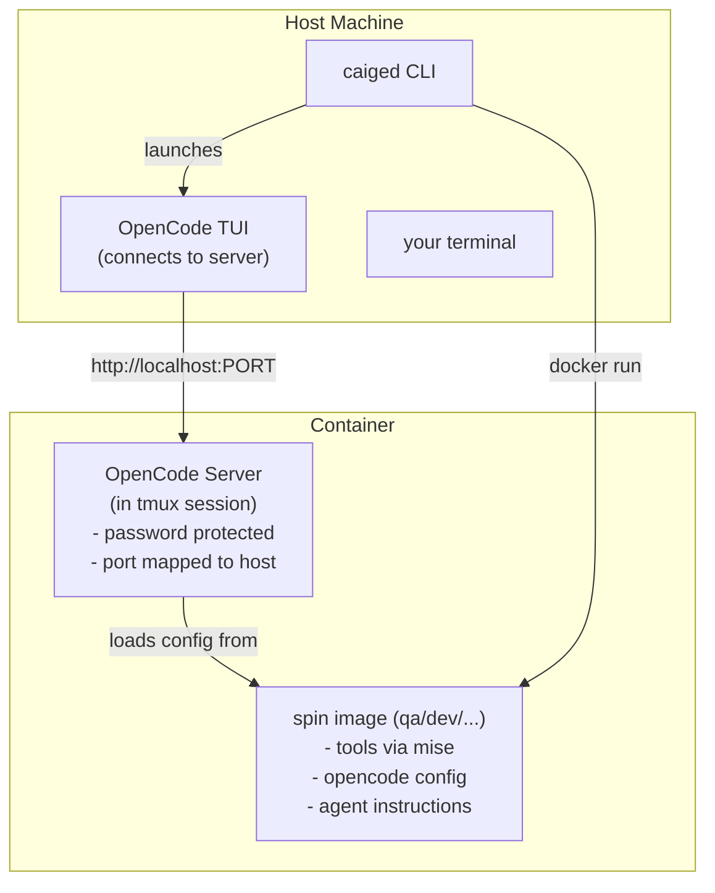

# Caiged for OpenCode

Caiged is a tool to gloss over the boring plumbing to run OpenCode in server mode in a docker container.
The goal is to restrict what your agent can do while maintaining relatively good UX and resource usage.

It allows you to create specially tailored OpenCode instances, that have their own AGENTS.md, and skills pre-configured,
which I call spins. This way you can have development, qa, security review etc. done with the tools you need in an easy way.

## Quickstart

### Install

```bash
git clone https://github.com/david-krentzlin/caiged.git ~/.caiged
cd ~/.caiged
make install
```


### Run

Inside the working directory of your project invoke the following: 

```bash
caiged . --spin dev             # Smart attach/create in current directory
```

This creates (or attaches to) a container with OpenCode server running, preconfigured with the dev spin.
You will be automatically dropped into OpenCode TUI (on your local machine) which connects to the OpenCode server in the container.


### Read the docs

```bash
man caiged
```

---

## Why Use Caiged?

If you have to use coding agents, then at least try to do it sensibly and don't give them access to your entire machine.
The natural approach to that is to put your agent into a dockerized environment. This can be tedious to do and maintain and you will likely end up
with a bunch of shell scripts to help yourself. Caiged has just taken this problem and turned it into a little go program and a process that makes this
easier and gets you productive.

## How is that different to docker sandbox?

[Docker sandboxes](https://docs.docker.com/ai/sandboxes/) solve fundamentally the same problem, but make different trade-offs.

Docker sandboxes give you higher degrees of isolation, but at the cost of requiring more resources and making some use-cases very cumbersome.
If you want to run you agent in yolo mode without much supervision, docker sandboxes are the better option for you. Also, docker sandboxes provide
some other niceties like making sure you git configuration (username etc. are present)

Caiged, makes a different trade-off. It does not use a full vm but just a docker container, which is lighter on resource usage.
**It provides docker access through a mount of the host docker socket.** This means your agent will see other docker containers.
If that is not acceptable for you, please use docker sandboxes or something else.
In my workflows however I found that this is good enough and the filesystem isolation is what I really care about.
(More than once have I seen the agent wander off into the distance on my filesystem way outside the current working directory.)

---

## Prerequisites

You will need to have the following available on your host system:

* docker
* OpenCode
* go


## How does it work


Let's have a more detailed look at what happens when you create your first container

```bash
cd /path/to/your/project
caiged . --spin dev
```


1. **CLI** (`caiged`) builds the base image + spin image (if needed)
2. **Container** starts with your project directory bind-mounted
3. **OpenCode server** runs inside container with password authentication
4. **OpenCode TUI** connects to the server via HTTP from host

In a picture that looks something like this:




**Container naming**: `caiged-<spin>-<project>`
- Default project name: last two path segments of your working directory
- Override: `--project <name>`

**Password generation**: Deterministic SHA256 hash from container name + salt
- Salt stored in `~/.config/caiged/salt` (created once)
- CLI regenerates same password for connecting to existing containers


---

## Spins

Spins live under `spins/` and define a role-specific environment:
- `AGENTS.md`: detailed agent instructions and persona
- `skills/`: domain-specific skills (test generation, security review, etc.)
- `mcp/`: MCP server configs
- `README.md`: spin-specific documentation

**Creating new spins:**
The build process automatically handles new spins - just create a directory under `spins/<name>/` with the required files and run:

```bash
caiged build . --spin <name>
```

See [SPINS.md](SPINS.md) for detailed instructions on creating and contributing spins

---

### Common Workflows

**Default - just run it:**
```bash
caiged . --spin dev   # Current directory, dev spin
```

**Explicit workdir:**
```bash
caiged /path/to/project --spin qa
```

**Connect to an existing container by project name:**
```bash
caiged connect qa-myproject
```

**List all containers with easy-to-copy commands:**
```bash
caiged session list
```

**Stop everything:**
```bash
caiged session stop-all
```

**Force rebuild with latest tools:**
```bash
OPENCODE_VERSION=latest caiged --rebuild-images
```

**Pass selected host secrets into the container:**
```bash
export JFROG_OIDC_USER=...
export JFROG_OIDC_TOKEN=...

caiged --secret-env JFROG_OIDC_USER --secret-env JFROG_OIDC_TOKEN
```

## Container / Spin Security

- **Network**: uses bridge networking with port mapping
  - Bridge networking with port mapping allows secure OpenCode server access from host
  - Each container gets a unique port (starting at 4096) mapped to container port 4096
- **Docker socket**: mounted by default; disable with `--disable-docker-sock`
- **GitHub config**: mounted read-only from `~/.config/gh`; make read-write with `--mount-gh-rw`
- **OpenCode auth reuse**: host `~/.local/share/opencode/auth.json` is mounted read-only when available; disable with `--no-mount-opencode-auth`
- **Secret env passthrough**: only explicitly listed host env vars are passed to the container (`--secret-env NAME`, repeatable)

### Credentials

The container includes `gh` (GitHub CLI). Host `~/.config/gh` is mounted read-only by default.

OpenCode authentication behavior:
- By default, caiged mounts host `~/.local/share/opencode/auth.json` read-only when available
- If that file does not exist on the host, OpenCode starts unauthenticated in the container and you need to complete auth once there (`/connect`)
- Disable host auth reuse with `--no-mount-opencode-auth`

### Secret environment variables:
- Canonical approach: pass only explicit host env vars with `--secret-env`
- Pass selected host secrets with `--secret-env NAME` (repeatable), for example `JFROG_OIDC_USER` and `JFROG_OIDC_TOKEN`
- Or provide a Docker-compatible env file with `--secret-env-file /path/to/secrets.env`

**Example:**

```bash
caiged . --spin dev --secret-env JFROG_OIDC_USER --secret-env JFROG_OIDC_TOKEN
```

## Missing features

The following is what is still missing and an idea of what might come

* Provide GIT configuration
  - provide an easy way to commit under the user's git user name (optionally)
  - however I would like to use a different ssh-key just for the agent which is trusted on my github (this gives tracking of AI activity for free)
- Allow spins to provision the docker container with different tools

