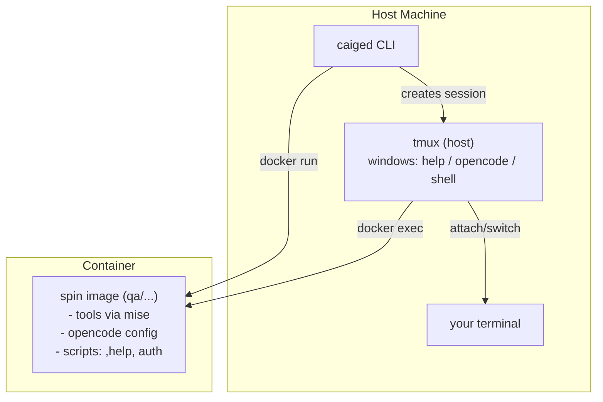

# Caiged

**Run AI coding agents in isolated, role-specific Docker environments.**

Caiged lets you launch coding agents (like OpenCode) inside Docker containers with:
- **Security-first design**: explicit bind mounts, minimal host access
- **Role-specific "spins"**: preconfigured agent personas (QA, engineer, reviewer) with tailored instructions, skills, and tools
- **Host tmux integration**: seamless multi-window workflow (help, opencode, shell) orchestrated from your terminal

```bash
caiged /path/to/project --spin qa
```

This spins up a QA-focused container and attaches you to a tmux session with three windows ready to go.

---

## Why Use Caiged?

**Isolation**: Keep AI agents from accidentally accessing sensitive files or making unintended system changes.

**Consistency**: Every team member gets the same tooling (gh, git, mise, bun, opencode) with pinned versions.

**Role-specific context**: QA agents get QA skills and instructions, reviewers get review workflows—no mixing concerns.

---

## Quick Start

### Installation

```bash
make install
```

This builds the CLI and copies it to `~/.local/bin/caiged`.

### Run Your First Spin

```bash
caiged . --spin qa
```

You'll see a tmux session with:
- **help window**: type `,help` for environment info
- **opencode window**: AI agent ready to work
- **shell window**: standard shell for manual commands

Inside the container:
- `,auth-tools` to authenticate gh and 1password

### Common Workflows

**Start a QA review session:**
```bash
caiged /path/to/project --spin qa
```

**Attach to an existing session:**
```bash
caiged session attach caiged-qa-myproject
```

**List all running sessions:**
```bash
caiged session list
```

**Stop everything:**
```bash
caiged session stop-all
```

**Force rebuild with latest tools:**
```bash
OPENCODE_VERSION=latest caiged "$(pwd)" --spin qa --force-build
```

---

## How It Works



1. **CLI** (`caiged`) builds the base image + spin image (if needed)
2. **Container** starts with your project directory bind-mounted
3. **Host tmux** creates a session with three windows, each running `docker exec` into the container
4. You attach to the tmux session and work inside the container via your terminal

**Container naming**: `caiged-<spin>-<project>`
- Default project name: last two path segments of your working directory
- Override: `--project <name>`

---

## Spins

Spins live under `spins/` and define a role-specific environment:
- `AGENTS.md`: detailed agent instructions and persona
- `skills/`: domain-specific skills (test generation, security review, etc.)
- `mcp/`: MCP server configs
- `README.md`: spin-specific documentation

**Available spins:**
- `qa`: exhaustive testing, security/reliability reviews, performance analysis

---

## Configuration

### Tools and Versions

Tools are installed via `mise` with versions pinned in `config/target_mise.toml`:
- bun 1.3.9
- go 1.26.0
- starship 1.24.2

OpenCode is installed via `bun add -g opencode-ai` (default `OPENCODE_VERSION=latest`).

### Security Defaults

- **Network**: enabled by default (required for opencode); disable with `--disable-network`
- **Docker socket**: mounted by default; disable with `--disable-docker-sock`
- **GitHub config**: mounted read-only from `~/.config/gh`; make read-write with `--mount-gh-rw`

### Credentials

The container includes `gh` (GitHub CLI) and `op` (1Password CLI). Run `,auth-tools` or `caiged-onboard` inside the container to authenticate.

---

## CLI Reference

Run `caiged --help` or `caiged <subcommand> --help` for full options.

**Main commands:**
- `caiged run <workdir>`: start a spin and attach to tmux session
- `caiged build <workdir>`: build images without running
- `caiged session attach <name>`: attach to existing session
- `caiged session list`: show all active sessions
- `caiged session restart <workdir>`: restart container and tmux
- `caiged session reset-session <workdir>`: reset tmux windows only
- `caiged session stop-all`: stop all caiged containers and sessions

**Key flags:**
- `--spin <name>`: which spin to use (required)
- `--project <name>`: override container/session name
- `--repo <path>`: caiged repo location (auto-detected when installed)
- `--force-build`: rebuild images even if they exist
- `--no-attach`: start container without attaching

---

## Development

### Build and Test

```bash
make acceptance
```

This runs the full build + acceptance test (spins up a nested container).

### Repo Discovery

When installed via `make install`, the CLI is compiled with the repo path embedded. If you move/delete the repo, set `--repo` or `CAIGED_REPO`.

---

## Contributing

Caiged is designed to be extensible. To add a new spin:

1. Create `spins/<name>/` with `AGENTS.md`, `skills/`, `mcp/`, `README.md`
2. Build and test: `caiged build . --spin <name>`
3. Run: `caiged . --spin <name>`

Contributions welcome!
