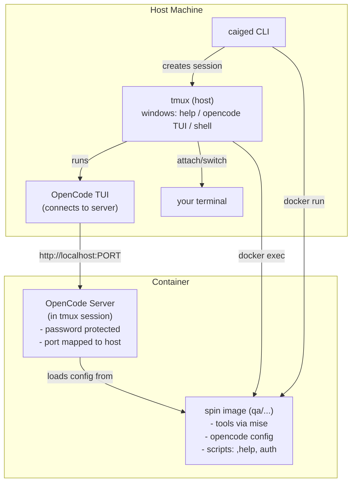

# Caiged

**Run AI coding agents in isolated, role-specific Docker environments.**

Caiged lets you launch coding agents (like OpenCode) inside Docker containers with:
- **Security-first design**: explicit bind mounts, minimal host access
- **Role-specific "spins"**: preconfigured agent personas (QA, engineer, reviewer) with tailored instructions, skills, and tools
- **OpenCode server mode**: each container runs an OpenCode server, connect from host with TUI or via tmux

```bash
caiged run /path/to/project --spin qa
```

This spins up a QA-focused container with OpenCode server running, ready to connect.

---

## Why Use Caiged?

**Isolation**: Keep AI agents from accidentally accessing sensitive files or making unintended system changes.

**Consistency**: Every team member gets the same tooling (gh, git, mise, bun, opencode) with pinned versions.

**Role-specific context**: QA agents get QA skills and instructions, reviewers get review workflows—no mixing concerns.

---

## Quick Start

### Installation

```bash
git clone <path-to-repo> ~/.caiged
cd ~/.caiged
make install
```

This builds the CLI and copies it to `~/.local/bin/caiged`.

### Run Your First Spin

```bash
cd /path/to/your/project
caiged run . --spin qa
```

You'll see connection information displayed:
```
Container: caiged-qa-myproject
OpenCode server: http://localhost:4096
Password: 0e6b8e70cce337aa57ed64431a950bfda9576873f50f11bcdd4129c4206b7b1f

To attach manually:
  opencode attach http://localhost:4096 --dir /workspace --password 0e6b8e70cce337aa57ed64431a950bfda9576873f50f11bcdd4129c4206b7b1f
```

Then you'll be attached to a tmux session with:
- **help window**: type `,help` for environment info
- **opencode window**: OpenCode TUI connected to the server
- **shell window**: standard shell for manual commands

Inside the container:
- OpenCode server runs inside a tmux session for easy debugging
- Password is automatically generated (deterministic from container name + salt)
- OpenCode auth is reused automatically from host `~/.local/share/opencode/auth.json` when present
- If host OpenCode auth is missing, run OpenCode auth once inside the container (`/connect` in the OpenCode TUI)
- For provider or service credentials, pass explicit secret env vars with `--secret-env`

### Common Workflows

**Start a QA review session:**
```bash
caiged run /path/to/project --spin qa
```

**Connect to an existing server with TUI:**
```bash
caiged connect myproject
```

**Show connection information:**
```bash
caiged port myproject
```

**Attach to an existing session:**
```bash
caiged session attach caiged-qa-myproject
```

**List all running sessions:**
```bash
caiged session list
```

**Stop everything:**
```bash
caiged session stop-all
```

**Force rebuild with latest tools:**
```bash
OPENCODE_VERSION=latest caiged run "$(pwd)" --spin qa --rebuild-images
```

**Pass selected host secrets into the container:**
```bash
export JFROG_OIDC_USER=...
export JFROG_OIDC_TOKEN=...

caiged run . --spin qa \
  --secret-env JFROG_OIDC_USER \
  --secret-env JFROG_OIDC_TOKEN
```

---

## How It Works



1. **CLI** (`caiged`) builds the base image + spin image (if needed)
2. **Container** starts with your project directory bind-mounted
3. **OpenCode server** runs inside container tmux session with password authentication
4. **Host tmux** creates a session with three windows:
   - `opencode attach` connects to the server via HTTP
   - Shell windows run `docker exec` into the container
5. You attach to the tmux session and work with the OpenCode TUI

**Container naming**: `caiged-<spin>-<project>`
- Default project name: last two path segments of your working directory
- Override: `--project <name>`

**Password generation**: Deterministic SHA256 hash from container name + salt
- Salt stored in `~/.config/caiged/salt` (created once)
- CLI regenerates same password for connecting to existing containers

---

## Spins

Spins live under `spins/` and define a role-specific environment:
- `AGENTS.md`: detailed agent instructions and persona
- `skills/`: domain-specific skills (test generation, security review, etc.)
- `mcp/`: MCP server configs
- `README.md`: spin-specific documentation

**Available spins:**
- `qa`: exhaustive testing, security/reliability reviews, performance analysis

**Creating new spins:**

The build process automatically handles new spins - just create a directory under `spins/<name>/` with the required files and run:

```bash
caiged build . --spin <name>
caiged run . --spin <name>
```

See [SPINS.md](SPINS.md) for detailed instructions on creating and contributing spins

---

## Configuration

### Tools and Versions

Tools are installed via `mise` with versions pinned in `config/target_mise.toml`:
- bun 1.3.9
- go 1.26.0

OpenCode is installed via `bun add -g opencode-ai` (default `OPENCODE_VERSION=latest`).

### Security Defaults

- **Network**: uses bridge networking with port mapping by default; disable with `--disable-network`
  - Bridge networking with port mapping allows secure OpenCode server access from host
  - Each container gets a unique port (starting at 4096) mapped to container port 4096
  - With `--disable-network`, container uses `--network=none` for full isolation
- **Docker socket**: mounted by default; disable with `--disable-docker-sock`
- **GitHub config**: mounted read-only from `~/.config/gh`; make read-write with `--mount-gh-rw`
- **OpenCode auth reuse**: host `~/.local/share/opencode/auth.json` is mounted read-only when available; disable with `--no-mount-opencode-auth`
- **Secret env passthrough**: only explicitly listed host env vars are passed to the container (`--secret-env NAME`, repeatable)

### Credentials

The container includes `gh` (GitHub CLI). Host `~/.config/gh` is mounted read-only by default.

OpenCode authentication behavior:
- By default, caiged mounts host `~/.local/share/opencode/auth.json` read-only when available
- If that file does not exist on the host, OpenCode starts unauthenticated in the container and you need to complete auth once there (`/connect`)
- Disable host auth reuse with `--no-mount-opencode-auth`

Secret environment variables:
- Canonical approach: pass only explicit host env vars with `--secret-env`
- Pass selected host secrets with `--secret-env NAME` (repeatable), for example `JFROG_OIDC_USER` and `JFROG_OIDC_TOKEN`
- Or provide a Docker-compatible env file with `--secret-env-file /path/to/secrets.env`

---

## CLI Reference

Run `caiged --help` or `caiged <subcommand> --help` for full options.

### Command Terminology

Commands use three distinct parameter types:

#### `<workdir>` - Directory Path
Used when the command needs to mount or access the actual directory:
- `caiged run <workdir>` - Mounts workdir into container
- `caiged build <workdir>` - Needs directory for build context
- `caiged session restart <workdir>` - Recreates container with workdir
- `caiged session reset-session <workdir>` - Resets session for workdir

#### `<project-name>` - Project Identifier
Used when the command only needs to find an existing container by project name:
- `caiged port <project-name>` - Shows connection info
- `caiged connect <project-name>` - Connects OpenCode TUI to server

Examples: `my-app`, `code-myproject`, `user-repo`

#### `<session-or-workdir>` - Flexible
- `caiged session attach <session-or-workdir>` - Can take either session name or workdir

### Main Commands

**Container lifecycle:**
- `caiged run <workdir>`: start a spin and attach to tmux session
- `caiged build <workdir>`: build images without running
- `caiged session restart <workdir>`: restart container and tmux

**Connecting to servers:**
- `caiged connect <project-name>`: launch OpenCode TUI connected to server
- `caiged port <project-name>`: show connection info (port, password, URL)

**Session management:**
- `caiged session attach <name>`: attach to existing tmux session
- `caiged session list`: show all active sessions and containers
- `caiged session reset-session <workdir>`: reset tmux windows only
- `caiged session stop-all`: stop all caiged containers and sessions

**Key flags:**
- `--spin <name>`: which spin to use (default: qa)
- `--project <name>`: override container/session name
- `--repo <path>`: caiged repo location (auto-detected when installed)
- `--rebuild-images`: rebuild images even if they exist
- `--no-attach`: start container without attaching to tmux

---

## Debugging

### Attach to OpenCode Server Session

The OpenCode server runs inside a tmux session within the container for easy debugging:

```bash
docker exec -it caiged-qa-myproject tmux attach -t opencode-server
```

This lets you see server logs, errors, and restart the server if needed.

### View Server Logs

```bash
docker exec caiged-qa-myproject tmux capture-pane -t opencode-server -p
```

### Manually Connect to Server

If tmux isn't working, you can connect directly:

```bash
# Get connection info
caiged port myproject

# Connect manually
opencode attach http://localhost:4096 --dir /workspace --password <password>
```

---

## Development

### Build and Test

```bash
make acceptance
```

This runs the full build + acceptance test (spins up a nested container).

### Repo Discovery

When installed via `make install`, the CLI is compiled with the repo path embedded. If you move/delete the repo, set `--repo` or `CAIGED_REPO`.

---

## What's missing

- Transferring environment variables into the container to include configuration (for example the jfrog oidc setup)

## Contributing

Caiged is designed to be extensible. To add a new spin:

1. Create `spins/<name>/` with `AGENTS.md`, `skills/`, `mcp/`, `README.md`
2. Build and test: `caiged build . --spin <name>`
3. Run: `caiged run . --spin <name>`

Contributions welcome!
